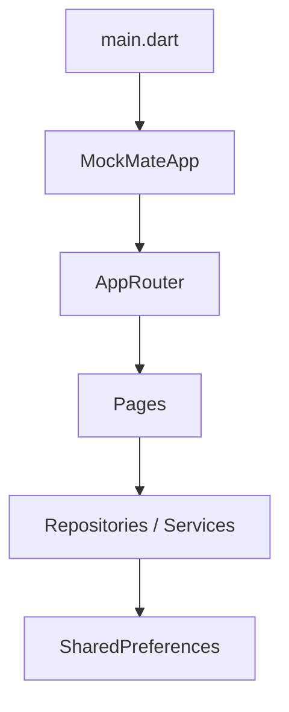

# MockMate Project Context

## 1. Executive Summary
MockMate is a real-time AI interview coaching application designed for the CU AI Nexus competition. It provides personalized interview preparation based on career profiles and target roles. Currently, the foundation is built using Flutter and Dart, with a feature-first architecture and SharedPreferences for local persistence. Key features like authentication, live voice interviews, and AI feedback remain unimplemented or exist only as temporary stubs. The project is locally operable but not yet connected to a backend.

## 2. Repository and Git State
- **Path:** `C:/Users/PC/Desktop/CuAiNexus`
- **Git Initialized:** Yes
- **Current Branch:** `main`
- **Current Commit:** `f73f6ec Fix file picker issue and update CV manager screen`
- **Configured Remotes:** `origin https://github.com/fady111-f/Ai-Nexus.git`
- **Working Tree Status:** Clean, except for recent uncommitted additions (`lib/core/routing/app_router.dart`, `lib/core/routing/app_routes.dart`, and models for Progress/Replay added in recent AI sessions).
- **Branch Sync:** Up to date with `origin/main`.
- **Secrets/Artifacts:** No apparent secrets committed. `build` directory is ignored.

## 3. Product Vision
- Personalized interview preparation
- CV-aware and target-job-based experiences
- Real-time voice conversations (English, Arabic, Tech-Arabish)
- Actionable interview feedback
- Long-term progress tracking

## 4. Current Implementation Status
The core application foundation is implemented: Sign In (temporary), Onboarding, Local Profile Persistence, and a Home Dashboard. Progress and Replay features have domain models and repository stubs but lack UI. Live interview and AI feedback are placeholders.

## 5. Technology Stack
- **Framework:** Flutter
- **Language:** Dart
- **State Management:** Custom constructor-based dependency injection
- **Persistence:** SharedPreferences (`shared_preferences`)

## 6. Dependency Inventory
**pubspec.yaml Constraints:**
- Flutter SDK: `flutter`
- Dart SDK: `^3.12.2`

**Dependencies:**
- `cupertino_icons: ^1.0.8`
- `shared_preferences: ^2.5.5`
- `file_picker: ^11.0.2`

**Dev Dependencies:**
- `flutter_test`
- `flutter_lints: ^6.0.0`

## 7. Project Structure
```text
lib/
├── app/                    # MockMateApp root widget
├── core/                   # Routing, theme, and shared app primitives
├── features/
│   ├── auth/               # Temporary authentication and Sign In UI
│   ├── cv_manager/         # CV Upload UI (Partial)
│   ├── home/               # Personalized dashboard and empty states
│   ├── interviews/         # Domain models and local repository for sessions
│   ├── live_interview/     # Placeholder UI for interviews
│   ├── onboarding/         # Profile model, persistence, and four-step flow
│   ├── profile/            # Placeholder Profile UI
│   ├── progress/           # (Planned) Progress Dashboard
│   ├── replay/             # (Planned) Interview Replay and audio controller
│   └── results/            # Placeholder Results UI
└── main.dart               # App composition and dependency wiring
```

## 8. Architecture
The app follows a feature-first architecture (`domain`, `data`, `presentation`).


- **Dependency Injection:** Constructor-based injection from `main.dart` downwards.
- **State Management:** `StatefulWidget` and standard `setState`. No external state management packages.

## 9. Application Entry and Dependency Injection
- **Entry Point:** `lib/main.dart`
- **Composition Root:** `MockMateApp` initialized with `TemporaryAuthService` and `LocalOnboardingService`.
- **DI:** Repositories are instantiated in `main.dart` and passed down to `MockMateApp`, then to `AppRouter`, which passes them to individual screens.

## 10. Routes and Navigation
**Routing Approach:** Built-in named routes via `onGenerateRoute` in `AppRouter`.

| Route | Page | Arguments | Entry Conditions | Exit Behavior | Status |
|---|---|---|---|---|---|
| `/sign-in` | `SignInPage` | None | Default entry | Replaced by Home/Onboarding | IMPLEMENTED |
| `/onboarding` | `OnboardingPage` | None | Incomplete profile | Replaced by Home | IMPLEMENTED |
| `/home` | `HomePage` | None | Completed profile | Exit app | IMPLEMENTED |
| `/profile` | `ProfileScreen` | None | Navigation from Home | Pop to Home | PARTIAL |
| `/cv-manager` | `CVManagerScreen`| None | Navigation from Home | Pop to Home | PARTIAL |
| `/live-interview` | `LiveInterviewScreen`| None | Navigation from Home | Pop to Results | PLACEHOLDER |
| `/results` | `ResultsScreen` | None | End of interview | Pop to Home | PLACEHOLDER |
| `/progress` | `ProgressPage` | None | Navigation from Home | Pop to Home | NOT IMPLEMENTED (Model only) |
| `/replay` | `InterviewReplayPage`| `ReplayRouteArguments` | From Progress/Recent | Pop to Progress | NOT IMPLEMENTED (Model only) |

## 11. Sign In and Authentication
- **Interface:** `AuthService`
- **Implementation:** `TemporaryAuthService` (local state `_isSignedIn = false`).
- **Status:** Temporary authentication. `signIn()` sets the boolean and proceeds. `Continue as Guest` uses the same flow.
- **Firebase:** NOT implemented.

## 12. Onboarding and User Profile
**UserProfile Schema:**
| Field | Dart Type | Required | Stored Value |
|---|---|---|---|
| careerField | `CareerField` enum | Yes | `String` (enum name) |
| experienceLevel | `ExperienceLevel` enum | Yes | `String` (enum name) |
| careerGoal | `CareerGoal` enum | Yes | `String` (enum name) |
| targetRole | `String` | Yes | `String` |
| preferredLanguage | `PreferredLanguage` enum | Yes | `String` (enum name) |
| preferredDifficulty| `InterviewDifficulty` enum| Yes | `String` (enum name) |

**Persistence:** Handled by `LocalOnboardingService` via SharedPreferences. Uses raw enum names.

## 13. Local Persistence
| Storage Key | Type | Owner | Purpose | Versioned | Corruption Handling |
|---|---|---|---|---|---|
| `mockmate_onboarding_profile` | `String` (JSON) | `LocalOnboardingService` | Stores UserProfile | No | Returns null on FormatException/TypeError |
| `mockmate_onboarding_completed` | `bool` | `LocalOnboardingService` | Flag for onboarding completion | No | Basic |
| `mockmate_interview_sessions_v1`| `String` (JSON) | `LocalInterviewRepository` | Stores InterviewSessions | Yes (1) | Clears corrupted data |

## 14. Home Dashboard
- Loads profile via `_profileFuture`.
- Shows greeting, setup summary, Quick Stats (placeholder zeroes), Interview DNA Preview (placeholder), and Recent Interview (empty state or placeholder).
- Start Interview shows a "Coming soon" modal.
- Shows truthful loading and error states if profile fails to load.

## 15. Progress Status
**NOT IMPLEMENTED (UI).** Domain models (`InterviewSession`, `ProgressCalculator`) and local repository exist, but `ProgressPage` is not created yet, leading to compilation errors if the route is triggered.

## 16. Replay Status
**NOT IMPLEMENTED (UI).** Domain models and `StubReplayAudioController` exist. `InterviewReplayPage` does not exist.

## 17. UI and Design System
- **Theme:** `MockMateTheme.dark`
- **Colors:** Custom `MockMateColors` (e.g., `primary`, `background`, `surfaceRaised`).
- **Typography:** Configured in theme.
- **Shared Widgets:** `MockMateBrand`, `_SkeletonBlock` (loading), `_HomeStatusState` (error/empty).

## 18. Error and Loading States
- Home implements `_HomeLoadingState` with skeleton loaders.
- Home implements `_HomeStatusState` for failed profile loads or incomplete setups.

## 19. Test Suite
| Test File | Area | Key Scenarios | Test Type |
|---|---|---|---|
| `widget_test.dart` | General | Basic counter/app load | Widget |
| `test/features/auth/temporary_auth_service_test.dart` | Auth | Sign in, sign out, state | Unit |
| `test/features/home/home_page_test.dart` | Home | Profile loading, empty states, modals | Widget |
| `test/features/onboarding/local_onboarding_service_test.dart` | Onboarding | Save/load profile, corruption handling | Unit |
| `test/features/onboarding/onboarding_flow_test.dart` | Onboarding | Validation, navigation, persistence | Widget |

- **Total Test Files:** 6
- **Note:** Tests currently fail due to `app_router.dart` referencing missing Progress/Replay pages.

## 20. Validation Results
- `flutter pub get`: Failed (incompatible dependency constraints with current flutter version)
- `dart format`: Completed (formatted 58 files)
- `flutter analyze`: 44 issues (mostly `use_super_parameters` and deprecated `withOpacity` in CV/live interview screens).
- `flutter test`: Failed (Compilation error: missing `ProgressPage` and `InterviewReplayPage` files).
- `flutter build apk`: Failed (Compilation error).
- `flutter build web`: Failed (Compilation error).

## 21. Current Audit Findings
From `reports/mockmate_audit/findings.json`:
- **STILL PRESENT:** Release builds use debug certificate.
- **STILL PRESENT:** Target Role landscape overflow.
- **STILL PRESENT:** Wrong-typed profile preference traps entry.
- **STILL PRESENT:** Accessibility issues (unlabeled inputs).
- **STILL PRESENT:** Unbounded text for Target Role.
- **STILL PRESENT:** Profile editing promised but missing.
- **STILL PRESENT:** Lack of versioned storage for profiles.
- **STILL PRESENT:** No localization readiness.

## 22. Implemented Features
- **Sign In:** IMPLEMENTED (Temporary)
- **Continue as Guest:** IMPLEMENTED
- **Onboarding:** IMPLEMENTED
- **Local Profile Persistence:** IMPLEMENTED
- **Home Dashboard:** IMPLEMENTED (with some placeholder sections)

## 23. Placeholders
- Start Interview Modal ("Coming soon")
- Interview DNA Preview (UI exists, data mocked)
- Quick Stats (UI exists, data zeros)
- Live Interview Screen (UI shell)
- Results Screen (UI shell)
- CV Manager (UI shell)
- Profile Screen (UI shell)

## 24. Intentionally Unimplemented Features
- Firebase Authentication
- Cloud Profile Storage
- Live AI Voice Interview Engine
- Real Session Recording & Persistence
- Progress Dashboard UI
- Interview Replay UI

## 25. Technical Debt
- UserProfile relies on raw enum strings without a schema version.
- `withOpacity` usage across newer files causes analyzer warnings.
- Test suite is currently broken due to uncompleted routing implementations for Progress/Replay.

## 26. Future Integration Seams
| Future System | Existing Interface/Seam | Required New Work | UI Impact |
|---|---|---|---|
| Firebase Auth | `AuthService` | Implement `FirebaseAuthService` | None (handled by interface) |
| Cloud Profile | `OnboardingRepository` | Implement `RemoteOnboardingService` | None |
| Progress/Replay | `InterviewRepository` | Build `ProgressPage`, `InterviewReplayPage` | Completes `/progress` and `/replay` routes |
| Live Interview | `/live-interview` route | Connect AI SDKs, WebRTC/Audio | Replaces placeholder UI |

## 27. Recommended Next Development Step
Fix the compilation errors in `app_router.dart` by either implementing `ProgressPage` and `InterviewReplayPage`, or temporarily reverting the router additions, to restore the test suite to a passing state.

## 28. Key File Index
- Entry Point: `lib/main.dart`
- Routing: `lib/core/routing/app_router.dart`
- Profile Model: `lib/features/onboarding/domain/models/user_profile.dart`
- Home Page: `lib/features/home/presentation/pages/home_page.dart`
- Session Model: `lib/features/interviews/domain/models/interview_session.dart`

## 29. Final Project Readiness Assessment
The project has a solid, testable architectural foundation for local user flows, but the test suite is currently broken due to half-implemented routing for upcoming features. It is not ready for production release (debug signing, no backend, incomplete features).
